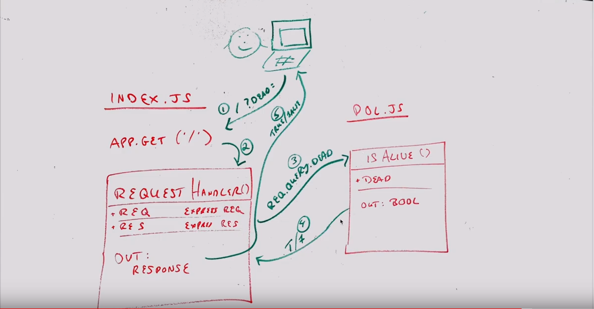

# LAB - 00

## Deployment Workshop

### Author: Conor McCue

### Links and Resources
* [submission PR](https://github.com/pseudotsuga-401-advanced-javascript/lab-00-deployment-workshop/pull/1)
* [travis](https://travis-ci.com/pseudotsuga-401-advanced-javascript/lab-00-deployment-workshop)
* [back-end](https://conormccue-lab-00.herokuapp.com/)

#### Documentation
* [JSdocs](https://conormccue-lab-00.herokuapp.com/docs)

### Setup
#### `.env` requirements
* `PORT` - Port Number

#### How to initialize/run your server app 
* `npm start`
  
#### Tests
* `npm test`

#### UML

